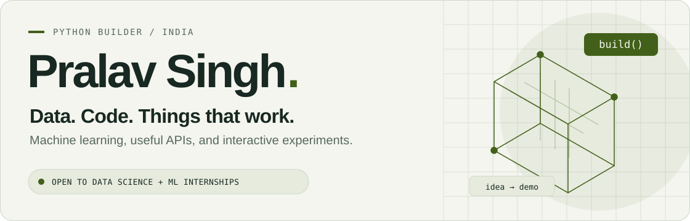
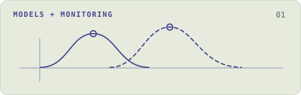
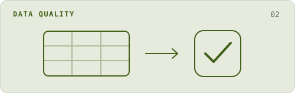
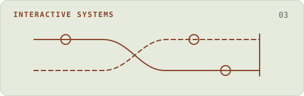
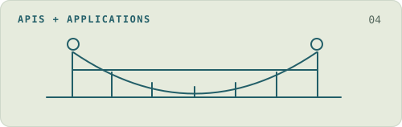
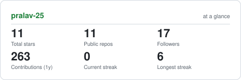

<picture>
  <source media="(prefers-color-scheme: dark)" srcset="assets/profile-hero-dark.svg">
  <source media="(prefers-color-scheme: light)" srcset="assets/profile-hero-light.svg">
  
</picture>

  
  
  

I build **Python tools that make data easier to trust and software easier to understand**. My focus: machine learning, data quality, and interfaces that let you explore what the code is doing.

**Based in India · Open to data science / ML internships**

## A few things I've built

<table>
<tr>
<td width="50%" valign="top">
<picture>
  <source media="(prefers-color-scheme: dark)" srcset="assets/feature-shiftwatch-dark.svg">
  <source media="(prefers-color-scheme: light)" srcset="assets/feature-shiftwatch-light.svg">
  
</picture>
<h3>ShiftWatch</h3>

<strong>What happens when the data changes?</strong>

A reproducible ML experiment and drift-monitoring dashboard. Compare models, explore synthetic shifts, or bring your own numerical CSVs.

<code>Python</code> <code>scikit-learn</code> <code>pandas</code> <code>React</code>

<a href="https://pralav-25.github.io/shiftwatch/"><strong>Try the dashboard ↗</strong></a> · <a href="https://github.com/pralav-25/shiftwatch">Code</a> · <a href="https://github.com/pralav-25/shiftwatch/blob/main/notebooks/wine-monitoring-analysis.ipynb">Notebook</a>

</td>
<td width="50%" valign="top">
<picture>
  <source media="(prefers-color-scheme: dark)" srcset="assets/feature-dataset-gate-dark.svg">
  <source media="(prefers-color-scheme: light)" srcset="assets/feature-dataset-gate-light.svg">
  
</picture>
<h3>Dataset Gate</h3>

<strong>Catch bad data before the pipeline does.</strong>

Turn CSV expectations into repeatable checks. Validate contracts, compare datasets, and keep a history of results with offline reports.

<code>Python</code> <code>FastAPI</code> <code>SQLite</code> <code>pytest</code>

<a href="https://github.com/pralav-25/dataset-gate#try-the-complete-workflow"><strong>Run the workflow ↗</strong></a> · <a href="https://github.com/pralav-25/dataset-gate">Code</a> · <a href="https://github.com/pralav-25/dataset-gate/blob/main/docs/rules.md">Rule guide</a>

</td>
</tr>
<tr>
<td width="50%" valign="top">
<picture>
  <source media="(prefers-color-scheme: dark)" srcset="assets/feature-interleave-dark.svg">
  <source media="(prefers-color-scheme: light)" srcset="assets/feature-interleave-light.svg">
  
</picture>
<h3>Interleave</h3>

<strong>Break the code. See why. Test the fix.</strong>

Step through concurrency bugs one operation at a time. Rewind, try a different schedule, and share the exact execution that broke.

<code>TypeScript</code> <code>React</code> <code>Cloudflare D1</code>

<a href="https://interleave-pralav.vercel.app"><strong>Open the lab ↗</strong></a> · <a href="https://github.com/pralav-25/interleave">Code</a> · <a href="https://github.com/pralav-25/interleave/blob/main/docs/MODEL.md">How it works</a>

</td>
<td width="50%" valign="top">
<picture>
  <source media="(prefers-color-scheme: dark)" srcset="assets/feature-structiq-dark.svg">
  <source media="(prefers-color-scheme: light)" srcset="assets/feature-structiq-light.svg">
  
</picture>
<h3>StructIQ</h3>

<strong>From a reported issue to a recorded fix.</strong>

A maintenance-workflow demo with private workspaces, asset maps, photo reports, public tracking, and an audit trail.

<code>FastAPI</code> <code>SQLAlchemy</code> <code>PostgreSQL</code>

<a href="https://github.com/pralav-25/StructIQ#run-locally"><strong>Explore the project ↗</strong></a> · <a href="https://github.com/pralav-25/StructIQ">Code</a> · <a href="https://github.com/pralav-25/StructIQ/tree/main/tests">Tests</a>

</td>
</tr>
</table>

**Also on my workbench:** [Python Algorithm Lab](https://github.com/pralav-25/python-algorithm-lab)—readable algorithms with runnable examples and independent tests. [DSA practice](https://github.com/pralav-25/DSA-Leet)—my problem-solving notebook in code.

## What I work with

| Data & ML | APIs & interfaces | Testing & delivery |
| :--- | :--- | :--- |
| Python · NumPy · pandas | FastAPI · SQLAlchemy | pytest · Ruff |
| scikit-learn · SciPy | PostgreSQL · SQLite | Git · GitHub Actions |
| Jupyter · Matplotlib | React · TypeScript · Tailwind | Reproducible experiments |

## Beyond the notebook

I also edit **short-form and sports videos in DaVinci Resolve**. Code and a timeline are two different ways to turn a rough idea into something people can use—or watch.

[See my video work ↗](https://www.instagram.com/ig_sinisterrrr/) · [Visit my portfolio ↗](https://pralav-singh-portfolio.vercel.app)

<strong>A little more: engineering details & GitHub activity</strong>

Some smaller changes show how I approach the edges of a project:

- [Protecting input files and making report writes atomic](https://github.com/pralav-25/shiftwatch/pull/1), with failure and file-alias regression tests.
- [Keeping missingness alerts consistent through export and reimport](https://github.com/pralav-25/shiftwatch/commit/6a23184133e213a17f5bc9ef07d634332cd39bec).
- [Rejecting malformed inventory updates without changing saved state](https://github.com/pralav-25/ResQChain/commit/4e277dfe1d7f28123315613d5367b84a00d8bf12).

<picture>
  <source media="(prefers-color-scheme: dark)" srcset="assets/card-stats-dark.svg">
  <source media="(prefers-color-scheme: light)" srcset="assets/card-stats-light.svg">
  
</picture>

[How this profile is maintained](docs/profile-maintenance.md)

---

**Have an internship, an interesting dataset, or a project to talk about?** [Let's connect.](mailto:singhpralav07@gmail.com)
