<div align="center">



<br />


### `Pralav Singh`

`full-stack developer` · `product builder` · `visual storyteller`

<br />

[](https://editing-portfolio-three.vercel.app)
[](https://github.com/pralav-25)
[](https://github.com/pralav-25?tab=repositories)

</div>

---

### `~/ whoami`

```txt
> cat about.txt

I build fast, expressive web products where engineering meets storytelling.
My work moves between full-stack experiences, AI-assisted systems, API security,
and interfaces that turn complex ideas into something people can actually use.

Current mode: learning deeply, shipping often, polishing the details.
```

### `~/ stack --active`

<p>
  
  
  
  
  
  
  
  
</p>

### `~/ projects --featured`

| Project | What it does | Built with |
| :--- | :--- | :--- |
| **[Editing Portfolio](https://github.com/pralav-25/Editing_Portfolio)** | A cinematic showcase for video-editing work. **[Live ↗](https://editing-portfolio-three.vercel.app)** | React 19 · TypeScript · Tailwind CSS · Cloudflare |
| **[FlowLock](https://github.com/pralav-25/FlowLock)** | Detects API abuse and rate-limit bypass patterns through behavioral signals. **[Live ↗](https://flow-lock-nine.vercel.app)** | HTML · Security UX · Data visualization |
| **[StructIQ](https://github.com/pralav-25/StructIQ)** | AI-driven infrastructure health monitoring with live sensor diagnostics. | Python · HTML · Predictive analytics |
| **[EduGram](https://github.com/pralav-25/EduGram)** | A gamified learning experience built to make education more engaging. **[Live ↗](https://edu-gram.vercel.app)** | HTML · CSS · JavaScript |

### `~/ activity --visualize`

<div align="center">


</div>

---

<div align="center">

`pralav@github:~$` **turning ideas into interfaces, one commit at a time.**

</div>
