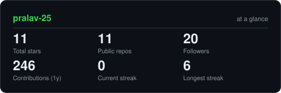
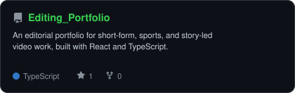
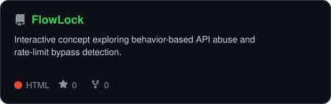
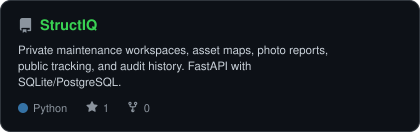
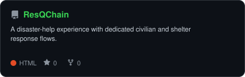

<!-- Profile system adapted from https://github.com/gargibhardwaj24/gargibhardwaj24 -->
<div align="center">

<!-- Generated from Pralav's GitHub avatar with scripts/dotify.py. -->


<br>

<a href="https://github.com/pralav-25">
  
</a>

<br>

<a href="https://editing-portfolio-three.vercel.app"></a>
<a href="https://www.instagram.com/ig_sinisterrrr/"></a>
<a href="https://github.com/pralav-25?tab=repositories"></a>

<br>


</div>

---

## `~/` whoami

```console
$ cat about.txt
```

Hi, I'm **Pralav Singh** — a developer and independent video editor from India. I build practical web products and visual stories, moving between product interfaces, problem-solving platforms, and rhythm-led edits.

- Building with **React, TypeScript, JavaScript, Python, and modern web tooling**
- Exploring **product engineering, API security, and AI-assisted systems**
- Editing short-form, sports, and music-led stories in **DaVinci Resolve**
- Portfolio: **[editing-portfolio-three.vercel.app](https://editing-portfolio-three.vercel.app)**
- Current principle: **every idea shipped teaches more than every idea saved.**

<br>

<div align="center">

## `~/` toolbox


<br>


</div>

---

<div align="center">

## `~/` skill radar

<table>
<tr>
<td width="50%" align="center" valign="middle">

<!-- Edit assets/skills.json to tune the hand-authored working-toolkit radar. -->
<picture>
  <source media="(prefers-color-scheme: dark)" srcset="assets/radar-dark.svg">
  <source media="(prefers-color-scheme: light)" srcset="assets/radar-light.svg">
  
</picture>

</td>
<td width="50%" align="center" valign="middle">

<!-- Generated from real language byte counts across public repositories. -->
<picture>
  <source media="(prefers-color-scheme: dark)" srcset="assets/radar-langs-dark.svg">
  <source media="(prefers-color-scheme: light)" srcset="assets/radar-langs-light.svg">
  
</picture>

</td>
</tr>
</table>

</div>

---

<div align="center">

## `~/` contribution calendar


<br><br>

<picture>
  <source media="(prefers-color-scheme: dark)" srcset="https://raw.githubusercontent.com/pralav-25/pralav-25/output/snake-dark.svg">
  <source media="(prefers-color-scheme: light)" srcset="https://raw.githubusercontent.com/pralav-25/pralav-25/output/snake.svg">
  
</picture>

</div>

---

<div align="center">

## `~/` the numbers

<picture>
  <source media="(prefers-color-scheme: dark)" srcset="assets/card-stats-dark.svg">
  <source media="(prefers-color-scheme: light)" srcset="assets/card-stats-light.svg">
  
</picture>

<br>


<br><br>


</div>

---

<div align="center">

## `~/` selected work

<!-- Cards are regenerated daily from assets/projects.json and the GitHub API. -->
<table>
<tr>
<td width="50%">
  <a href="https://github.com/pralav-25/Editing_Portfolio">
    <picture>
      <source media="(prefers-color-scheme: dark)" srcset="assets/card-Editing_Portfolio-dark.svg">
      <source media="(prefers-color-scheme: light)" srcset="assets/card-Editing_Portfolio-light.svg">
      
    </picture>
  </a>
</td>
<td width="50%">
  <a href="https://github.com/pralav-25/FlowLock">
    <picture>
      <source media="(prefers-color-scheme: dark)" srcset="assets/card-FlowLock-dark.svg">
      <source media="(prefers-color-scheme: light)" srcset="assets/card-FlowLock-light.svg">
      
    </picture>
  </a>
</td>
</tr>
<tr>
<td width="50%">
  <a href="https://github.com/pralav-25/StructIQ">
    <picture>
      <source media="(prefers-color-scheme: dark)" srcset="assets/card-StructIQ-dark.svg">
      <source media="(prefers-color-scheme: light)" srcset="assets/card-StructIQ-light.svg">
      
    </picture>
  </a>
</td>
<td width="50%">
  <a href="https://github.com/pralav-25/ResQChain">
    <picture>
      <source media="(prefers-color-scheme: dark)" srcset="assets/card-ResQChain-dark.svg">
      <source media="(prefers-color-scheme: light)" srcset="assets/card-ResQChain-light.svg">
      
    </picture>
  </a>
</td>
</tr>
</table>

<sub>

| project | live | stack |
|---|---|---|
| **[Editing Portfolio](https://github.com/pralav-25/Editing_Portfolio)** | [view portfolio](https://editing-portfolio-three.vercel.app) | `React` `TypeScript` `Tailwind CSS` |
| **[FlowLock](https://github.com/pralav-25/FlowLock)** | [open app](https://flow-lock-nine.vercel.app) | `HTML` `CSS` `JavaScript` |
| **[StructIQ](https://github.com/pralav-25/StructIQ)** | [source](https://github.com/pralav-25/StructIQ) | `Python` `HTML` `SQLite` |
| **[ResQChain](https://github.com/pralav-25/ResQChain)** | [open app](https://res-q-chain.vercel.app) | `HTML` `CSS` `JavaScript` |

</sub>

</div>

---

<div align="center">

<sub>`01100101 01110110 01100101 01110010 01111001 00100000 01101001 01100100 01100101 01100001 00100000 01110011 01101000 01101001 01110000 01110000 01100101 01100100`</sub>

</div>
