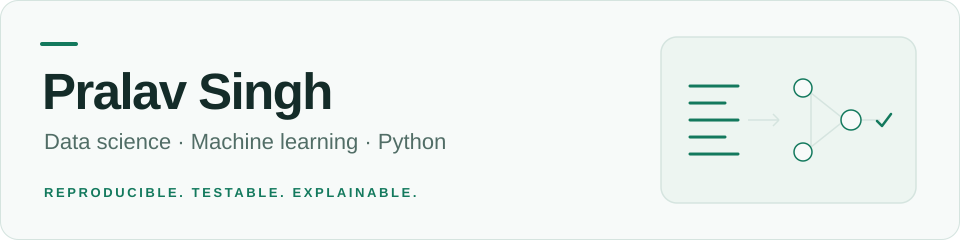

<picture>
  <source media="(prefers-color-scheme: dark)" srcset="assets/profile-banner-dark.svg">
  <source media="(prefers-color-scheme: light)" srcset="assets/profile-banner-light.svg">
  
</picture>

**Open to data science / ML internships · Based in India**

My projects combine reproducible model evaluation, numerical data monitoring,
and the APIs and interfaces that make results easy to inspect.

[Portfolio](https://pralav-singh-portfolio.vercel.app) ·
[Email me](mailto:singhpralav07@gmail.com) ·
[Try ShiftWatch](https://pralav-25.github.io/shiftwatch/) ·
[Try Interleave](https://interleave-pralav.vercel.app)

## Featured work

### ShiftWatch — inspect model performance and data drift

Compare a dummy baseline, logistic regression, and random forest on UCI Wine
using training-only cross-validation and a separate holdout. Inspect synthetic
feature shifts and missingness, or compare numerical CSVs through the Python CLI.

**Python · pandas · scikit-learn · SciPy · Jupyter · React**

[Live dashboard](https://pralav-25.github.io/shiftwatch/) ·
[Executed notebook](https://github.com/pralav-25/shiftwatch/blob/main/notebooks/wine-monitoring-analysis.ipynb) ·
[Source](https://github.com/pralav-25/shiftwatch) ·
[Tests](https://github.com/pralav-25/shiftwatch/actions/workflows/ci.yml) ·
[Announcement](https://github.com/pralav-25/shiftwatch/discussions/3)

The dataset is small and the shifts are synthetic; the results describe this
experiment. [Methodology and limitations](https://github.com/pralav-25/shiftwatch/blob/main/docs/methodology.md).

### StructIQ — manage maintenance reports in private workspaces

An infrastructure-maintenance app with photo reports, public tracking,
audit history, and account-scoped data. Supports SQLite for local use and
PostgreSQL for deployment.

**Python · FastAPI · SQLAlchemy · SQLite · PostgreSQL**

[Source and setup](https://github.com/pralav-25/StructIQ) ·
[API tests](https://github.com/pralav-25/StructIQ/tree/main/tests)

### Interleave — reproduce a concurrency bug, then test its fix

Control two workers in six deterministic experiments. Rewind an execution,
inspect the state, share a replay, or save a private investigation. Optional
local AI assistance discusses the selected trace.

**TypeScript · React · Cloudflare D1 · WebLLM**

[Live workbench](https://interleave-pralav.vercel.app) ·
[Source](https://github.com/pralav-25/interleave) ·
[Model assumptions](https://github.com/pralav-25/interleave/blob/main/docs/MODEL.md) ·
[Announcement](https://github.com/pralav-25/interleave/discussions/1)

The lab explores finite teaching models. Optional AI requires WebGPU;
[real-device inference quality is not yet validated](https://github.com/pralav-25/interleave/blob/main/docs/AI.md).

## Engineering work you can inspect

| Problem | Change and evidence |
| --- | --- |
| A report write could damage an input CSV or an existing report. | [Atomic writes and input-file protection](https://github.com/pralav-25/shiftwatch/pull/1), with failure and file-alias regression tests. |
| A missingness alert could disappear when a dashboard report was exported. | [Consistent export and reimport](https://github.com/pralav-25/shiftwatch/commit/6a23184133e213a17f5bc9ef07d634332cd39bec), checked against shared threshold cases. |
| Malformed inventory updates could change the shelter demo's saved state. | [Reject the whole invalid update](https://github.com/pralav-25/ResQChain/commit/4e277dfe1d7f28123315613d5367b84a00d8bf12), preserving valid partial edits. |

## Tools used across these projects

- **Data:** Python, NumPy, pandas, SciPy, scikit-learn, Matplotlib, Jupyter
- **Applications:** FastAPI, SQLAlchemy, PostgreSQL, React, TypeScript, Tailwind CSS
- **Validation:** pytest, Ruff, Git, GitHub Actions

I also edit short-form and sports video in DaVinci Resolve.
[Video work](https://www.instagram.com/ig_sinisterrrr/) ·
[Developer portfolio source](https://github.com/pralav-25/pralav-25.github.io)

GitHub activity

<picture>
  <source media="(prefers-color-scheme: dark)" srcset="assets/card-stats-dark.svg">
  <source media="(prefers-color-scheme: light)" srcset="assets/card-stats-light.svg">
  
</picture>

[How this profile is maintained](docs/profile-maintenance.md)
